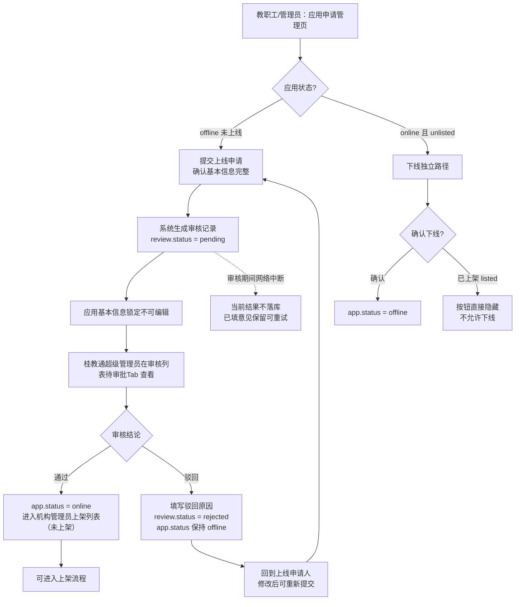
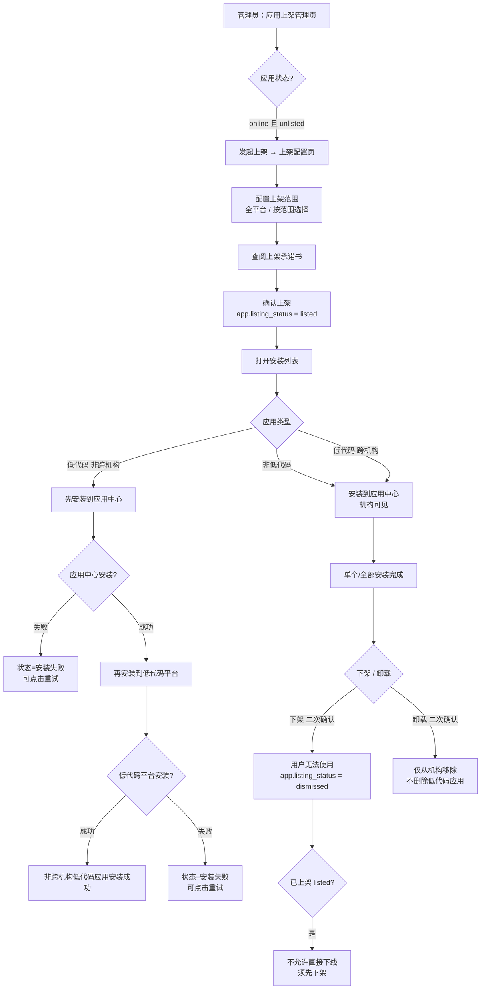
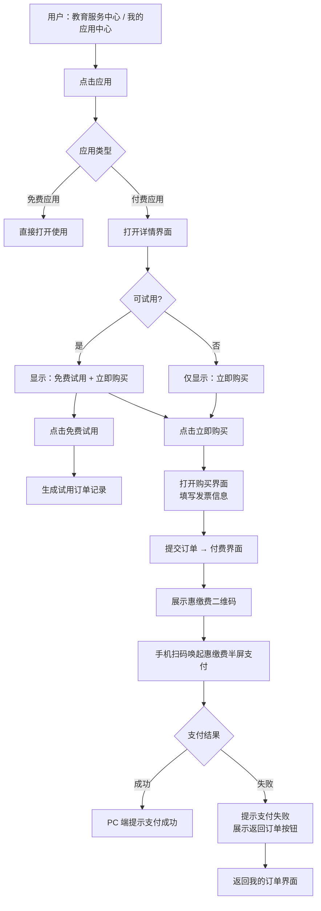
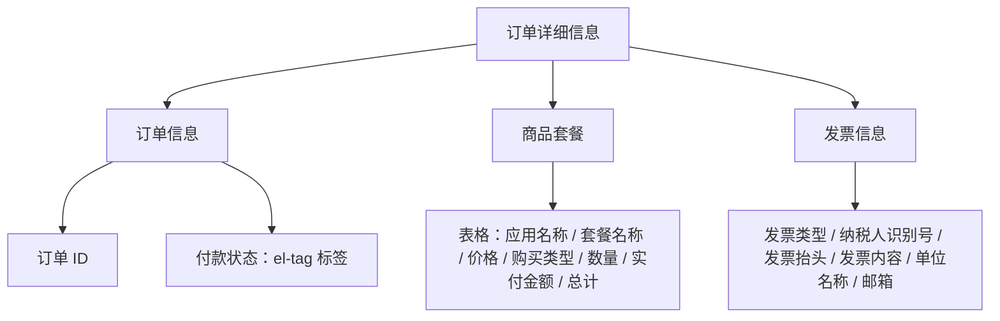

# 应用中心重构 - 产品需求文档

> 版本：v2.0
> 状态：初稿
> 基于 design.md v2.0

| 版本 | 日期 | 修订人 | 修订说明 | 状态 |
|------|------|--------|----------|------|
| v2.0 | 2026-07-17 | 孙美 | 重写：适配 design v2.0（范围改名、分类管理重构、审核管理重构、删除共享功能、补充 4 个状态机） | 初稿 |

---

## 一、文档概述

本文档为应用中心重构的产品需求规格说明，面向多租户应用全生命周期管理平台，覆盖租户内应用申请→审核→上架→范围→安装、平台级应用监管与运营统计、教育服务超市集成以及订单管理的完整功能定义。

## 二、范围

### 2.1 建设范围

| 模块 | 包含功能 |
|------|---------|
| 应用管理 | 应用申请管理、应用上架管理、全平台应用（超管专属）、上架范围管理、应用分类管理、应用审核管理、标签管理 |
| 平台管理 | 应用统计 |
| 订单管理 | 订单套餐授权管理、订单记录管理（应用购买的订单）、试用套餐记录管理、应用套餐配置 |
| 门户端 | 教育服务超市、付费应用购买页、我的空间、我的应用中心、我的订单 |

### 2.2 明确不做

- 实体商品购物车功能（从原商城页面移除）
- 商城支付流程改造（保持商城现有支付流程不变）
- 库存管理、对账结算
- 跨机构应用共享功能

## 三、业务流程

### 3.1 应用上线申请审核流程
此处管理员指的是桂教通超级管理员和机构管理员。
教职工/管理员新增应用、上线申请、管理员审核、结果归档三个阶段。

1. 教职工/管理员在应用申请管理页对已创建但未上线（app.status = offline）的应用提交上线申请。提交前确认应用基本信息完整，提交后系统生成一条审核记录（review.status = pending）。此时应用不可编辑基本信息。
2. 桂教通超级管理员在审核列表的"待审批"Tab 中看到该记录，查看应用详情后选择"通过"或"驳回"。通过后 app.status 变为 online，应用进入机构管理员的应用上架管理列表（P04），状态为未上架（listing_status = unlisted）；驳回时需填写驳回原因，review.status 变为 rejected，app.status 保持 offline。
3. 审核通过后应用可进入上架流程。审核驳回后回到上线申请人，修改后可重新提交上线申请。审核记录永久保留。

审核期间网络中断时，当前审核结果不落库，已填写意见保留并允许重试。

下线为独立路径，不经过审核：应用创建人或管理员对 app.status = online 且 app.listing_status = unlisted 的应用点击"下线"，弹窗确认后直接变为 offline；已上架（listing_status = listed）的应用不允许下线，按钮直接隐藏。

### 3.2 应用上架及安装流程

管理员上架应用、配置范围、安装三个环节。

1. 管理员对已上线（online）且未上架（unlisted）的应用发起上架，进入上架配置页，配置上架范围（全平台或按范围选择），P05 展示上架承诺书文案及链接供查阅后确认。确认后 app.listing_status 变为 listed。已上架的应用，点击对应的上架范围，打开应用安装列表，点击机构对应的安装按钮为单个安装，点击全部安装则安装到当前安装列表的所有租户下，卸载和全部卸载通用的逻辑；
2. 安装的流程：非低代码应用安装，只安装到应用中心即让应用在机构可见，因为不像低代码有安装包；低代码应用安装分跨机构和不跨机构安装，跨机构安装同非低代码流程；不跨机构安装，会先安装到应用中心，如果应用中心安装失败，则状态变为安装失败，点击安装按钮可重新安装；应用中心安装成功后，再安装到低代码平台，若安装成功则非跨机构的低代码应用安装成功；若低代码平台安装失败则状态为安装失败，可点击重试按钮，继续安装到低代码平台。
3. 下架和卸载均需二次确认。下架后用户无法使用，卸载仅从指定机构移除，不删除低代码应用。已上架的应用不允许直接下线，必须先下架方可下线。

### 3.3 应用付费购买流程

用户在教育服务中心或者我的应用中心点击应用，免费应用直接打开使用，付费应用则打开详情界面，若可试用则显示免费试用和立即购买按钮，否则值立即购买按钮。
点击免费试用，生成一条试用订单记录；点击立即购买打开订单确认 & 开票信息填写界面，发票信息录入右上角提供"历史发票记录"入口，点击可查看当前人员历史发票记录，选择一条后自动回填至发票信息表单，也可手动填写发票信息；点击提交订单跳转到付费界面，展示跟惠缴费对接的二维码，手机扫码唤起惠缴费半屏支付，支付成功后PC端支付状态同步提示支付成功，支付失败则提示失败，同时出现返回订单的按钮点击返回我的订单界面

## 四、详细需求说明

### （一）应用管理模块

本模块负责租户内应用的申请、上架、范围配置、分类管理和审核全流程，包含 12 个页面。

模块级权限规则：默认 tenant_admin 与教职工具备本机构应用的管理权限（新增/编辑应用、提交上线申请、上架配置本人应用）；platform_admin 和 platform_operator 仅可查看，不可修改租户应用数据；tenant_user（非教职工）无此模块访问权限。

#### P01 应用申请管理页

页面由筛选区、结果列表和行内操作组成。筛选区提供应用名称、分类、状态的检索条件；列表按创建时间倒序排列，每页 20 条，展示应用关键信息和状态标签。

（1）查询和查看应用列表

用户进入页面后首先看到当前筛选条件下的应用列表，可以直接判断每条应用的上下线状态和基本属性。列表默认展示：应用 Logo（32×32 圆角图标）、应用名称（超 20 字符末尾截断，悬停显示全文）、应用ID（业务应用ID，置于应用名称之后）、应用openId（仅桂教通超级管理员列展示，置于应用ID之后）、应用分类（一级分类为主标，二级分类为副标灰字）、应用类型（平台应用/非平台应用，仅桂教通超级管理员列展示）、应用属性（完整属性文本，如"原生应用""原生应用/低代码应用""生态应用"）、适用机构（多值枚举展示，如"学校""上级单位"）、适用学段（多值徽标展示，仅适用机构包含学校时显示）、状态标签（已上线绿色徽标，未上线灰色徽标）。

- 修改筛选条件后点击"搜索"，列表按当前条件刷新；点击"重置"清空所有条件恢复默认视图。
- 查询无匹配数据时，列表区域显示"暂无应用"。
- 查询失败时列表区域显示"加载失败，请重试"和刷新按钮。

（2）新增应用

tenant_admin 可在任意状态下点击列表页右上角"新增应用"按钮，跳转 P02 应用申请编辑页（新建模式，底部按钮为"新建"）。

（3）上线应用

仅 app.status = offline 的应用行显示"上线"按钮。点击后进入 P02b 应用详情页（上线申请模式），页面底部呈现"确认上线"主按钮和"取消"次按钮。

点击"确认上线"前系统校验应用的 Logo、名称、分类等必填项是否完整。校验不通过时顶部红色提示"应用信息不完整，请先完善"，阻止提交。校验通过后系统生成一条审核记录（review.type = 上线，review.status = pending，review.applicant = 当前登录人），toast 提示"上线申请已提交，待桂教通超级管理员审核"，返回列表页。

网络异常导致提交失败时，顶部红色提示"提交失败，请检查网络后重试"。

（4）管理应用

所有状态（上线/下线）的应用行均显示"管理"按钮。点击后进入 P02b 应用详情页（管理模式），可查看凭证区和完整信息，并通过"修改"链接跳转 P02 编辑模式。

审核中的应用"管理"按钮置灰，悬停提示"审核中，不可查看详情"。

（5）下线应用

仅 app.status = online 且 app.listing_status = unlisted 时显示"下线"按钮。已上架（listing_status = listed）时该按钮直接隐藏。

点击"下线"弹出确认框"确定要下线该应用吗？"，确认后 app.status = offline，无需审核，不生成审核记录。下线失败时顶部红色提示"操作失败，请检查网络后重试"。

（6）查看应用（非管理员视图）

其他用户（非 tenant_admin）访问本页时，仅对 app.status = online 的应用行显示"查看"按钮。点击进入 P02b 应用详情页（只读查看模式），无任何操作按钮。

#### P02 应用申请编辑页

页面采用垂直单列表单布局，从上至下依次排列字段。所有标记 * 的字段为必填，未通过校验时对应字段红框提示并阻止提交。

（1）新建应用（新建模式）

从 P01"新增应用"入口进入，页面底部按钮为"新建"和"取消"。表单字段及其规则如下：

| 字段 | 必填 | 控件 | 规则 |
|------|:----:|------|------|
| 应用 Logo | * | 图片上传 | jpg/png/jpeg，推荐 140×140 圆角 24px，≤200KB；缺失提示"请上传应用 Logo"；格式/大小不符时在区域下方红字提示原因 |
| 应用名称 | * | 单行文本框 | 最大 20 字符，右侧实时显示"已输入字数/20"；超限禁止继续输入；名称在同租户内唯一，重复时字段下方红字"该应用名称已存在，请更换" |
| 应用简介 | * | 多行文本框 | 最大 100 字符，右下实时显示"已输入字数/100" |
| 所属分类 | * | 级联选择 | 先选一级分类，再级联选择对应二级分类 |
| 应用类型 | * | 单选 | 平台应用 / 非平台应用；仅桂教通超级管理员展示且必填，机构管理员新增应用默认非平台应用（不展示此字段） |
| 是否数据同步 | * | 单选 | 否 / 是，默认否 |
| 用户个人信息授权 | * | 单选 | 否 / 是，默认否 |
| 推送地址 | * | 文本框 | 仅是否数据同步=是时展示；校验格式为 http:// 或 https://，必填 |
| TOKEN | * | 只读文本框 | 仅是否数据同步=是时展示；点击右侧「随机生成Token」按钮生成 UUID，最大 50 字符，必填 |
| EncodingAesKey | * | 只读文本框 | 仅是否数据同步=是时展示；点击右侧「随机生成AesKey」按钮生成 32 字节 AES-256 密钥后 Base64 编码（去掉 = 填充），固定 43 字符，必填 |
| 打开方式 | * | 多选复选框 | PCweb / H5 / 独立小程序，至少 1 项 |
| 适用机构 | * | 多选复选框 | 学校 / 上级单位，至少 1 项 |
| 适用学段 | * | 单选+多选 | 范围模式为单选（所有学段/部分学段，默认所有学段）；仅适用机构含"学校"时展示与校验；选"部分学段"时下方展开学段多选：幼儿园/小学/初中/高中/中职/高职/本科/研究生，支持多选，至少 1 项 |
| 应用详情介绍 | * | 富文本编辑器 | 支持粗体/斜体/下划线/删除线/引用/代码/列表/字号/颜色/对齐/超链接/图片/视频/清除格式；占位提示"请上传应用图文介绍、操作文档、演示视频…"；≤5MB HTML；必填 |
| 应用视频介绍 |   | 上传组件 | 附件上传，支持多选，accept="video/*"，最多 5 个视频，单个 ≤10MB |
| 应用属性 | * | 级联选择 | 一级：原生应用/生态应用（默认原生）；选原生应用时级联二级：低代码应用/自建应用；选生态应用时展示 suiteID 输入 |
| suiteID |   | 单行文本框 | 仅应用属性=生态应用时展示，最大 64 字符；生态应用时必填，缺失提示"请填写 suiteID" |
| 应用ID | * | 单行文本框 | 仅应用属性=低代码应用时展示；输入低代码应用ID，必填，缺失提示"低代码应用请填写应用ID" |
| 可见性-移动端角色 | * | 多选 | 仅打开方式含独立小程序时展示；10 类角色：教育局职工/学生/学校教职工/家长/毕业生/退休教职工/机构管理员/临时成员/公共账号/开发者，至少 1 项 |
| 可见性-移动端地址 | * | 前缀下拉+文本框 | 仅打开方式含独立小程序时展示，展示时必填；前缀下拉选择 http/https，文本框填写域名或路径，地址最大 500 字符（不含前缀） |
| 可见性-微信 appid | * | 文本框 | 仅打开方式含独立小程序时展示，最大 64 字符 |
| 可见性-PC 端角色 | * | 多选 | 仅打开方式含 PCweb 时展示；同移动端角色枚举，至少 1 项 |
| 可见性-PC 端地址 | * | 前缀下拉+文本框 | 仅打开方式含 PCweb 时展示，展示时必填；前缀下拉选择 http/https，文本框填写域名或路径，地址最大 500 字符（不含前缀） |
| 可见性-H5 角色 | * | 多选 | 仅打开方式含 H5 时展示；同移动端角色枚举，至少 1 项 |
| 可见性-H5 地址 | * | 前缀下拉+文本框 | 仅打开方式含 H5 时展示，展示时必填；前缀下拉选择 http/https，文本框填写域名或路径，地址最大 500 字符（不含前缀） |
| 白名单配置 |   | 默认回填标签+新增按钮+白名单输入行列表 | 默认根据已填写的移动端/PC端/H5 地址自动回填（标签展示完整地址，标签带删除按钮，删除后不再自动回填展示）；点击"新增白名单"按钮新增一条白名单输入行（前缀下拉 http/https + 文本框 + 删除按钮，文本框宽度与表单其他字段一致），输入完成后自动拼入白名单；重复地址去重；最多 5 个（含默认回填），达到上限禁用新增；手动行支持删除 |
| 查看接入文档 |   | 链接 | 蓝色文字链接，点击新窗口打开接入文档 URL |

点击"新建"触发全量校验，未通过时页面滚动定位到首个错误字段。校验通过后写入 app 记录，系统自动生成 app.system_suite_id（全局唯一，不可修改）与 app.system_suite_key，同时自动生成业务应用ID（app.app_id，当前最大应用ID +1、全局唯一）与应用 openId（app.app_open_id：非低代码应用生成长度 15 的英文/数字/下划线串，低代码应用取填写的低代码应用ID），并生成 review 记录（review.status = pending），toast 提示"上线申请已提交，待桂教通超级管理员审核"，返回 P01 列表。

- 单字段失焦触发即时校验（Logo/名称/简介/分类/打开方式/机构/学段/属性/suiteID）。
- 网络异常时已填写内容通过 localStorage 保留 24 小时。
- 网络异常提交失败时顶部红条"提交失败，请检查网络后重试"。
- 若表单未修改直接点击"取消"，直接返回来源页；若已修改，弹出二次确认"当前编辑未保存，确认离开？"。

（2）编辑应用（编辑模式）

从 P02b 应用详情页的"修改"链接进入，字段按当前值回填，底部按钮为"提交"和"取消"。

提交时全量校验必填项。校验通过后覆盖写入 app 记录（app.system_suite_id 不变）。如属于已上架应用，同步生成一条待审核 review 记录，toast 提示"提交成功，需重新上架审核后生效"，返回 P02b。

#### P02b 应用详情页

页面由面包屑、头部凭证区、基本信息区（上线申请模式下基本信息区下方嵌入「上线配置」区，二者同属一个模块）和底部操作区组成。根据进入入口分为四种模式：管理模式（P01"管理"进入，仅 online 应用）、上线申请模式（P01"上线"进入，仅 offline 应用）、只读查看模式（P01 其他用户"查看"进入）、审核详情模式（P10"详情"进入）。

（1）查看头部凭证区

| 展示项 | 字段 | 形式 |
|-------|------|------|
| 应用 Logo | app.logo | 大尺寸圆角图标，与凭证区左右布局 |
| 应用标题 | app.name + 分类拼接 | 加粗标题 |
| SuiteId | app.system_suite_id | 标签+值两栏，纯只读，全局唯一不可修改 |
| SuiteKey | app.system_suite_key | 标签+值两栏 + 右侧"更新"链接按钮 |

仅管理模式显示 SuiteKey 的"更新"链接。上线申请模式不展示凭证区（应用尚未通过审核，凭证未生成）。只读查看模式和审核详情模式显示凭证区但不显示"更新"链接。

（2）更新 SuiteKey

点击"更新"弹出确认弹窗，标题为"提示"，正文为"更新后，原 SecretKey 会在 2 天后失效，请尽快完成相应调整，保证应用的正常使用，是否确定现在更新？"，底部提供"取消"和"确定"按钮。弹窗禁止点击遮罩关闭。点击"确定"后弹窗关闭，系统重新生成 app.system_suite_key，同步刷新 app.system_suite_key_updated_at，页面值刷新为新值，toast 提示"SuiteKey 已更新"。旧 Key 从更新时刻起 2 天内仍可用（后端兼容期）。点击"取消"或关闭按钮无任何变更。

SuiteKey 更新失败时 toast 红色提示"SuiteKey 更新失败，请稍后重试"，页面值保持原值。

（3）查看基本信息区

板块标题为"基本信息（修改的信息需要重新上架审核后生效）"，右侧提供"修改"链接按钮（仅管理模式显示）。点击"修改"跳转 P02 编辑模式，字段全部回填。

基本信息区依次只读展示以下分组。超长文本的处理方式：应用名称截断悬停，应用介绍使用富文本渲染自带滚动。

- 基础信息：应用 Logo（大图预览）、应用名称、应用介绍、所属分类（级联路径，如"教学管理/课堂工具"）
- 打开方式：中文枚举全称，多值以顿号分隔（PCweb / H5 / 独立小程序）
- 适用范围：适用机构、适用学段（mode=all 时展示"所有学段"）
- 详情介绍：应用详情介绍（只读富文本渲染，必填字段）
- 应用视频：展示已上传视频文件列表（名称标签），无视频时隐藏
- 应用属性：应用属性（完整属性，如"原生应用/低代码应用"）、生态 suiteID（仅 type=ecosystem 时展示）
- 数据与授权：是否数据同步（是/否）、用户个人信息授权（是/否）、推送地址、TOKEN、EncodingAesKey（仅数据同步=是时展示推送地址/TOKEN/EncodingAesKey）、应用来源
- 收费与可见：移动端可见性（角色列表+访问地址+微信 appid，仅打开方式含独立小程序时展示）、PC 端可见性（角色列表+地址，仅打开方式含 PCweb 时展示）、H5 可见性（角色列表+地址，仅打开方式含 H5 时展示）、白名单（标签列表展示，默认回填三个地址，最多 5 个）

（4）底部按钮

所有底部按钮居中显示。

**管理模式**：仅显示"返回"按钮，操作通过头部 SuiteKey「更新」与基本信息区「修改」入口执行。

**上线申请模式**：应用基本信息区下方（同一模块内）新增可编辑「上线配置」区（与 P05 原上架配置一致，但仅含除"范围选择""分享范围"以外的配置项），提交/返回按钮统一置于模块最下方，显示「提交」（主）+「返回」（次）。点击"提交"前系统核对应用必填字段完整性及上线配置必填项，且须勾选上架承诺书（未勾选时"提交"置灰）；缺项时顶部红色提示"应用信息不完整，请先完善"，阻止提交。校验通过后系统生成 review 记录（review.type = 上线，review.status = pending），toast 提示"上线申请已提交，待桂教通超级管理员审核"，返回 P01 列表。

上线配置区（上线申请模式）字段及显示逻辑：
- 是否跨机构（radio 是/否，*）：仅低代码应用展示；桂教通超级管理员选"是"时联动展示跨机构层级与所属租户，机构管理员选"是"时不展示这两项。
- 跨机构层级（radio 厅/市/区县，*）：仅桂教通超级管理员 + 低代码应用 + 是否跨机构=是 时显示。
- 所属租户（下拉选择 + 添加按钮，*）：仅桂教通超级管理员 + 低代码应用 + 是否跨机构=是 时显示；点击"添加"弹出机构选择框（按跨机构层级弹性展示机构，≤10 以列表点击回填，>10 以下拉选择）。
- 收费方式（radio 收费/免费，*）：仅非低代码应用展示；选"收费"时联动展示是否可试用、试用套餐、授权套餐。
- 是否可试用（radio 是/否，*）：仅非低代码应用 + 收费方式=收费 时显示；选"是"时展示试用套餐。
- 试用套餐（下拉，*）：仅非低代码应用 + 收费方式=收费 + 是否可试用=是 时显示。
- 授权套餐（下拉多选，*）：仅非低代码应用 + 收费方式=收费 时显示；数据来源应用套餐配置（套餐管理），可多选多条套餐。
- 版本号（下拉搜索框，单选）：仅低代码应用展示；是否跨机构 = 否 时必填（*），是否跨机构 = 是 时非必填；按当前低代码应用ID远程获取版本列表，未获取到则提示"需要上架应用到低代码应用市场"。
- 上架承诺书（checkbox，必勾选）：文案"我已仔细阅读并完全同意应用免责声明及上架承诺书，自愿承担一切相关法律责任。"点击蓝色链接弹出五条免责声明弹窗（禁止点击遮罩关闭，仅"我知道了"关闭）；未勾选时"提交"按钮置灰。

该应用已被删除或不属于当前租户时，页面顶部提示"应用不存在或无查看权限"，隐藏所有操作按钮。

（5）查看审核信息（审核详情模式）

审核信息板块展示当前应用最近一条上线审核记录：申请类型（上线/下线）、审核状态徽标（待审核黄色/通过绿色/驳回红色）、申请人、申请时间、审核人、审核时间、审核备注（驳回时高亮显示）。若应用从未提交过审核记录，整块板块隐藏。

#### P04 应用上架管理页

页面由筛选区、结果列表和行内操作组成。

（1）查询上架应用列表

筛选栏提供应用名称、应用分类、上架范围（下拉，本租户范围列表）。点击"搜索"按条件刷新列表；点击"重置"清空条件恢复默认视图。

列表按创建时间倒序，每页 20 条，展示：应用 Logo、应用名称、应用分类（一级/二级）、应用类型（平台应用/非平台应用，仅桂教通超级管理员列展示）、开发者名称、应用来源（当前租户名称）、应用属性（完整属性文本，如"原生应用""原生应用/低代码应用""生态应用"）、上架范围（当前应用关联的范围名称列表，超链接形式可点击进入 P04b）、创建时间、上架状态（已上架/已下架/未上架标签）。

（2）上架应用

仅 listing_status = unlisted 且 app.status = online 的应用行显示"上架"按钮。点击进入 P05 应用上架配置页。

（3）下架应用

仅 listing_status = listed 时显示"下架"按钮。点击弹出确认框"确认要下架 XXX 吗？下架后全区用户将无法使用此应用，已安装的应用不会被卸载"。确认后 listing_status = dismissed（已下架），仅使应用从范围不可见，不卸载已安装的应用。

P04 页面顶部以两个 Tab 组织：**应用上架管理**（见上）与**应用分享管理**（当前机构分享给其他机构 / 桂教通平台的应用）。

（4）应用分享管理

展示当前机构已分享给其他机构或桂教通平台的应用，分享范围于上架时记录。

筛选栏提供应用名称、应用分类（下拉）、应用属性（下拉：平台应用/非平台应用）。点击"搜索"按条件刷新列表；点击"重置"清空条件。

列表展示：应用 Logo、应用名称、应用属性（展示应用类型内容，原生应用/生态应用 + 低代码应用/自建应用等）、应用分类（应用对应的分类）、分享范围（记录上架时分享范围，桂教通平台及每个被分享机构均逐一列出，如"桂教通平台、南宁市第一中学、柳州市高级中学、桂林市育才小学、北海市实验学校、玉林市第一初级中学、梧州市实验小学"）、分享时间、操作（停止分享）。

停止分享：点击行内"停止分享"弹出"停止分享"弹窗。弹窗内"停止分享范围"为下拉多选，逐一列出该应用上架时分享的每个范围：桂教通平台 + 每个被分享机构名称（如分享时选了 6 个机构，则这 6 个机构逐一列出，必填）。提交后：从对应机构的应用上架管理界面停止分享该应用；若应用当前已上架（listing_status = listed）则自动下架（listing_status = dismissed，已安装应用不卸载）；所选分享范围清空后，该应用从分享列表移除。

#### P04b 应用安装列表页

由 P04 上架范围超链接进入，面包屑为"应用上架管理 / 安装列表（{范围名称}）"，展示所选范围覆盖的全部机构。页面根据当前应用的应用属性自动展示对应的安装流程说明（原生应用 / 低代码应用），不再提供手动切换。

（1）查询和查看机构安装状态

筛选栏提供机构名称、机构 ID、安装状态（安装成功/安装失败/未安装）查询，按钮包含"搜索""重置""全部安装""全部卸载"。

列表展示：机构名称、机构 ID、机构类型（教育局机构/学校）、所在城市、安装状态（三态标签：安装成功、安装失败、未安装）、安装失败原因（仅安装失败展示具体失败原因，其余显示"—"）。默认按机构名称升序排列，每页 20 条。

安装流程说明：
- 原生应用（非低代码）：应用安装只需安装到应用中心，安装成功后根据上架范围及应用可用学段在我的应用中心展示。
- 低代码应用：安装流程为安装到应用中心、成功后安装到低代码平台，两步均成功才算安装成功；若应用中心安装失败或低代码平台安装失败，状态均为"安装失败"，可在"安装失败原因"查看原因并重试。

（2）单机构安装/卸载

- 行尾"安装"按钮（仅未安装机构显示）或"重试"按钮（仅安装失败机构显示）。点击弹窗提示"是否确认将【应用名称】应用在【机构名称】安装？"，确认后安装成功，toast 提示"安装成功"。
- 行尾"卸载"按钮（仅已安装机构显示）。点击弹窗提示"是否确认将【应用名称】应用从【机构名称】卸载？"，确认后卸载成功，toast 提示"卸载成功"。

（3）全部安装/卸载

- "全部安装"按钮：弹窗"是否确认将【应用名称】应用安装到全部机构/学校？"，确认后后台执行全量安装任务，toast"已提交全部安装"。
- "全部卸载"按钮：弹窗"是否确认将【应用名称】应用从所有机构/学校卸载？"，确认后后台执行全量卸载任务，toast"已提交全部卸载"。

#### P05 应用上架配置页

由 P04"上架"按钮进入，页面分为应用基本信息区（只读）与上架配置区两部分（上架配置区仅保留"范围选择"与"分享范围"；是否跨机构、收费方式、版本号、授权套餐等其余上线配置项已迁移至 P02b 上线申请模式，随上线申请一并提交）。底部按钮居中："取消"和"确认上架"。

> 上架配置区仅保留"范围选择"与"分享范围"两项（其余上线配置项已迁移至 P02b 上线申请模式）。字段按"应用是否为低代码应用"（由应用信息的应用属性判断，非手动切换）与"操作人角色"展示：
> - **范围选择**：桂教通超级管理员：是否跨机构=否时全平台/按范围（必填），是否跨机构=是时仅按范围；机构管理员：全平台/按范围（必填，对低代码/非低代码均展示，全平台=上架到当前机构及所有下级机构并自动安装应用中心）。
> - **分享范围**：仅机构管理员展示（低代码/非低代码均展示）；多选（桂教通平台/其他机构，非必填）；勾选"其他机构"时联动展示机构模糊搜索多选框（输入机构名称模糊筛选、最多 50 条、可多选）。

（1）上架配置

应用基本信息区完整展示 P02b 管理模式全部字段（头部凭证区展示 SuiteId/SuiteKey 仅只读文本 + 基本信息全字段：应用名称/简介/所属分类/打开方式/机构/学段/应用详情介绍/应用视频/属性/数据同步/用户个人信息授权/来源/移动端角色地址/微信appid/PC端角色地址/H5角色地址/白名单），仅隐藏"更新"与"修改"链接，凭证区不显示操作按钮。

上架配置区依次包含以下字段：

| 字段 | 控件 | 必填 | 联动规则 |
|------|------|:----:|---------|
| 范围选择 | radio 全平台/按范围 | *（机构管理员必填） | 桂教通超级管理员：是否跨机构=否时全平台/按范围（必填），是否跨机构=是时仅按范围；机构管理员：全平台/按范围（必填，对低代码/非低代码均展示） |
| 分享范围 | checkbox 桂教通平台/其他机构 | 否 | 机构管理员展示（低代码/非低代码均展示）；多选、非必填；勾选"其他机构"时联动展示"其他机构"机构多选框（模糊搜索、最多 50 条、可多选） |

> 说明：是否跨机构、跨机构层级、所属租户、收费方式、是否可试用、试用套餐、授权套餐、版本号及上架承诺书 checkbox 已迁移至 **P02b 应用详情页 - 上线申请模式**，随上线申请一并提交；本页仍展示上架承诺书文案及蓝色链接，供管理员查阅。

范围选择的具体交互：
- 桂教通超级管理员：是否跨机构=否时全平台（文本提示"全平台指的是上架到当前机构所有下属机构和学校"）/ 按范围（可搜索下拉框多选，数据来源本租户上架范围管理）；是否跨机构=是时仅显示"按范围"。
- 机构管理员：全平台/按范围单选、必填（低代码/非低代码均展示）。全平台=上架到当前机构及所有下级机构并自动安装到应用中心；按范围=可搜索下拉框多选（数据来源本机构上架范围管理）。确认上架后按所选范围在应用上架管理新增未上架数据（应用来源 = 当前机构名称）。
- 分享范围 + 其他机构（仅机构管理员，低代码/非低代码均展示）：分享范围多选（桂教通平台/其他机构，非必填）；勾选"其他机构"时展示机构模糊搜索多选框（输入机构名称模糊筛选、最多 50 条、可多选）。

（2）确认上架

确认上架后 app.listing_status = listed，toast"上架成功"，返回 P04。

> P05 底部仍展示上架承诺书文案及蓝色链接，点击可打开免责声明弹窗；勾选/同意承诺书作为提交校验项已迁移至 P02b 上线申请模式。

#### P06 全平台应用页

桂教通超级管理员专属页面，跨机构查看**全平台已上架应用**并支持强制下架治理。仅超管可见（tenant_admin、教职工不可访问）。菜单入口：应用管理 → 全平台应用。

（1）查询区

| 字段 | 控件 | 说明 |
|------|------|------|
| 应用名称 | 文本框 | app.name 模糊查询 |
| 应用分类 | 级联下拉 | app.category_id，一级→二级 |
| 应用ID | 文本框 | app.app_id 精确匹配（业务应用ID） |

按钮：搜索、重置。

（2）列表展示

数据范围：仅 `app.listing_status = listed` 的应用（跨全部租户）。列如下：

| 列 | 字段 | 备注 |
|----|------|------|
| Logo | app.logo | 圆角图标 |
| 应用名称 | app.name | — |
| 应用ID | app.app_id | 业务应用ID |
| 应用openId | app.app_open_id | — |
| 上架租户 | app.tenant_name | 关联带出 |
| 应用分类 | app.category | 级联路径（一级/二级） |
| 应用类型 | app.app_type | 平台应用/非平台应用 |
| 应用属性 | app.type + app.native_type | 拼接展示，如"原生应用/低代码应用" |
| 适用机构 | app.institution_scope | 多值 |
| 学段 | app.school_levels_mode + app.school_levels | 多值 |
| 状态 | app.listing_status | 展示为"已上架"标签 |
| 操作 | 强制下架 | 见下 |

（3）操作：强制下架

- 仅 `app.listing_status = listed` 行显示。
- 点击弹窗二次确认："确定要强制下架【{app.name}】吗？下架后该应用在【{app.tenant_name}】的上架列表将变为未上架状态，已安装的应用不会被卸载。"
- 确认后：
  - `app.listing_status = unlisted`（回到未上架，与租户自主下架进入 dismissed 区别）
  - 已安装应用不卸载（沿用租户下架规则）
  - 写入 OperationLog：`log.action = force_delist`、`log.operator_role = platform_admin`，detail 记录被下架应用、原上架租户、执行人
  - toast「强制下架成功」，列表刷新（该条因不满足 listed 条件被移出）
- 对应机构管理员在 P04 应用上架管理页看到该应用状态由"已上架"回落为"未上架"。
- 取消：不变更。

（4）说明

- 本页不提供其他跨机构操作（无编辑、无审核、无上架），仅治理性下架
- 状态列固定展示"已上架"（因数据范围已过滤 listed），保留字段占位用于未来扩展

#### P07 上架范围管理页

页面顶部为两个 Tab 切换："自定义范围"和"默认范围"。

（1）查看自定义范围列表

展示本租户手动创建和维护的范围。

- 查询条件：范围名称（输入框）、类型（下拉：自定义/按教育机构/按标签），支持「查询」「重置」，按条件筛选列表。
- 列表列：范围名称（**蓝色字体、鼠标悬停显示手型指针，点击跳转「范围机构列表」页面（P07a）**）、范围 ID、范围类型（自定义/按教育机构/按标签）、范围摘要、创建时间、创建人。另有状态列（启用绿色标签/停用红色标签）和操作列（编辑 + 删除仅停用显示 + 停用/启用按钮合并在一列）。删除、启用、停用均需弹窗二次确认。

（2）查看默认范围列表

展示系统自动生成的范围（如教育局市场自动生成的默认范围），列表列：范围名称、范围 ID、创建时间。仅可查看，无编辑或管理操作。默认范围名称与机构名称一致（如：广西壮族自治区教育厅、南宁市教育局、南宁市青秀区教育局、横州市教育局、桂林市教育局等）。

**范围机构列表页（P07a）**

点击自定义范围列表中的「范围名称」跳转进入独立页面（P07a），展示当前范围内覆盖的全部机构，支持分页查询：
- 页面元素：返回按钮（回到 P07）、页面标题「范围机构列表」、当前范围名称展示。
- 查询条件：机构名称（输入框）、机构类型（下拉）、机构 ID（输入框），支持「查询」「重置」。
- 列表列：机构名称、机构 ID、机构类型。
- 分页：底部分页器（每页 10 条，支持翻页与总条数展示），查询条件变化后回到第 1 页重新分页。
- 操作按钮：查询区右侧提供「同步范围机构」按钮。点击后调用后端接口校验当前范围是否已包含该范围类型下全部机构：
  - 若未全部包含，后端自动将遗漏的机构补足到当前范围，前端刷新列表并提示「已同步范围机构，新增 N 个机构」；
  - 若已全部包含，提示「当前范围机构已完整，无需同步」。

#### P08 上架范围编辑页

由 P07 自定义范围 Tab 的"创建范围"或"编辑"按钮进入。页面标题根据模式动态显示"创建自定义范围"或"编辑自定义范围"，编辑模式下回填范围名称和类型。

（1）创建/编辑自定义范围

垂直单列表单，从上至下依次为：

| 字段 | 必填 | 控件与交互 |
|------|:----:|-----------|
| 范围名称 | * | 文本框，最大 50 字符 |
| 范围类型 | * | radio：自定义 / 按教育机构 / 按标签。切换时可见范围控件联动切换 |
| 可见范围 | * | 联动切换；所有类型选择后通过 el-tag 标签展示已选内容（flex-wrap 自动换行，一行可展示多个），每个 tag 可关闭删除 |
| — 自定义 | * | 输入框 + "添加" + "批量导入"（type=primary 蓝色）。输入 orgid（多个以英文逗号隔开），点击"添加"以 el-tag 展示在下方的标签区中；"批量导入"弹窗支持下载模板、上传 .xlsx/.xls 文件；已添加的 orgid 以 closable el-tag 排列 |
| — 按教育机构 | * | 下拉多选。选择后在下方以 el-tag 标签展示，可关闭删除；可见范围为选中机构及其下级所有学校 |
| — 按标签 | * | 下拉多选（数据源来自标签管理中的标签）。选择后在下方以 el-tag 标签展示，可关闭删除 |
| 不可见范围 |   | 输入框 + "添加"按钮。输入 orgid 点击"添加"后在下方以 el-tag 展示，可关闭删除；所有范围类型下均展示 |

保存后根据不同模式 toast「范围创建成功」或「范围编辑成功」，返回 P07。保存时校验范围名称不为空、可见范围不为空。编辑模式下至少保留一条可见范围。

#### P09 应用分类管理页

页面由筛选查询区、"新增分类"按钮和树形列表组成。树形列表最多 2 级（一级→二级），一级和二级分类按层级展示。

（1）查看分类树

筛选条件为分类名称（模糊查询），点击搜索按钮刷新列表。树形列表每行展示：分类名称、分类编码、排序号、状态标签（启用绿色/停用红色）。行内操作按钮包括：添加下级（仅已启用一级分类显示）、编辑、启用/停用、删除（仅停用状态显示）。

同一层级按排序号升序排列，排序相同时按 id 最新优先。无匹配数据时显示"暂无分类"。

（2）新增分类（一级）

点击"新增分类"弹出表单：

| 字段 | 必填 | 控件 | 规则 |
|------|:----:|------|------|
| 分类名称 | * | 文本框 | 最大 30 字符 |
| 分类编码 | * | 文本框 | 最大 20 字符，仅限数字和英文；同一层级不可重复；输入时自动过滤非数字英文字符 |
| 排序 | * | 数字输入框 | 默认值 1 |

提交时校验名称和编码在同一层级不重复。校验通过后树刷新。

（3）添加下级分类

选中已启用的一级分类行，点击"添加下级"弹出表单：

| 字段 | 必填 | 控件 | 规则 |
|------|:----:|------|------|
| 上级分类 | * | 只读文本 | 带出当前分类名称 |
| 分类名称 | * | 文本框 | 最大 30 字符 |
| 分类编码 | * | 文本框 | 最大 20 字符，仅限数字和英文；同一层级不可重复 |
| 排序 | * | 数字输入框 | 默认值 1 |

提交时校验名称和编码在同一层级不重复。最多可建 2 级分类，二级分类下不再显示"添加下级"入口。

（4）编辑分类

点击"编辑"弹出表单，弹窗回填分类名称、编码（禁用）、排序。只可修改分类名称和排序，编码不可修改。

（5）启用/停用分类

- 点击"停用"弹窗二次确认"停用后，当前分类及下级分类将停用，请确认是否停用"，确认后当前及所有下级 status = disabled。
- 点击"启用"弹窗二次确认"启用后，当前分类及下级分类将启用，请确认是否启用"，确认后当前及所有下级 status = enabled。

（6）删除分类

仅已停用（status = disabled）的分类行显示"删除"按钮。已启用分类不显示删除按钮。

点击"删除"弹窗二次确认"数据删除后，无法找回，请确认是否继续删除？"，确认后删除该分类。

#### P10 应用审核列表页

页面顶部为两个 Tab 切换："待审批"和"已审批"。筛选栏提供应用名称模糊查询，支持搜索和重置按钮。

（1）查看待审批列表

筛选条件：应用名称（模糊查询），支持搜索和重置。列表展示：应用 ID、应用名称、应用类型、开发者名称、申请时间。按申请时间倒序排列，每页 20 条。底部显示分页信息。

操作列：显示"审核"按钮（仅 review.status = pending 时显示）和"查看"按钮（任意状态均可点击）。

（2）查看已审批列表

筛选条件同待审批。列表展示：应用 ID、应用名称、应用类型、开发者名称、申请时间、审核时间、审核结果标签（通过绿色/驳回红色）、审核人。

操作列仅显示"查看"按钮。

#### P11 应用审核操作页（审批模式）

由 P10 待审批 Tab 行尾"审核"按钮进入。页面分两张卡片：上方卡片展示应用完整信息（全部只读），下方卡片展示审批操作区。底部按钮居中。

（1）查看应用信息（上方卡片）

应用详情区域展示同 P02b 管理模式一致的全部字段，包括：

| 展示项 | 说明 |
|-------|------|
| 凭证区 | Logo、应用标题（名称+分类拼接）、SuiteId 只读文本、SuiteKey 只读文本（无更新按钮） |
| 基础信息 | 应用名称、应用简介、所属分类（级联路径） |
| 打开方式 | PCweb、H5、独立小程序 |
| 适用范围 | 适用机构、适用学段 |
| 详情介绍 | 应用详情介绍（只读富文本渲染，必填字段） |
| 应用视频 | 已上传视频文件标签列表 |
| 应用属性 | 应用属性（完整属性，如"原生应用/低代码应用"） |
| 数据与授权 | 是否数据同步（是/否）、用户个人信息授权（是/否）、推送地址、TOKEN、EncodingAesKey（仅数据同步=是时展示推送地址/TOKEN/EncodingAesKey）、应用来源 |
| 可见性 | 移动端（独立小程序）角色列表+地址+微信appid、PC端（PCweb）角色列表+地址、H5角色列表+地址、白名单（标签列表），按打开方式动态展示 |

（2）审批操作（下方卡片）

| 字段 | 必填 | 控件 | 规则 |
|------|:----:|------|------|
| 审批结果 | * | radio | 通过 / 驳回 |
| 审批意见 |   | 多行文本框 | 最大 200 字符，show-word-limit；驳回时 * 必填，通过时非必填 |

- 驳回时校验审批意见不为空，通过时无需校验。
- 点击"提交"：审批结果=通过时 review.status = approved，app.status = online，应用进入机构管理员的应用上架管理列表（listing_status = unlisted），写入 reviewer 和 reviewed_at，toast「审核通过，应用已进入机构管理员上架列表（未上架）」；审批结果=驳回时 review.status = rejected，app.status 保持 offline，review_comment = 审批意见，toast「已驳回」。
- 网络异常时结果不落库，已填写意见保留可重试。

#### P11v 审核详情页（查看模式）

由 P10 两个 Tab 的"查看"按钮进入。页面分两张卡片：上方卡片展示应用完整信息（同 P11 上方卡片完全一致），下方卡片展示审批信息只读。底部居中"返回"按钮。

（1）查看应用信息（上方卡片）

同 P11 应用信息，展示全部字段（凭证区、基础信息、打开方式、范围、详情、视频、属性、可见性）。

（2）查看审批信息（下方卡片）

| 展示项 | 字段 |
|-------|------|
| 申请时间 | review.created_at |
| 申请人 | review.applicant |
| 审批人 | review.reviewer（未审核时显示"---"） |
| 审批时间 | review.reviewed_at（未审核时显示"---"） |
| 审批结果 | review.status el-tag 标签（通过绿色/驳回红色），未审核时显示"---" |
| 审批意见 | review.review_comment（无时显示"---"） |

#### P12 标签管理页

标签用于范围可见范围的多维度配置，支持按自定义机构或按机构类型设定可见范围。

（1）查看标签列表

展示所有标签：标签 ID、标签名称（蓝色字体、鼠标悬停显示手型指针，点击跳转「标签机构列表」页面（P12a））、标签类型（自定义标签/机构类型标签）、关联范围数量。无标签时显示"暂无标签"。

（2）新建标签

点击"新建标签"弹出弹窗，包含以下字段：

| 字段 | 必填 | 控件 | 规则 |
|------|:----:|------|------|
| 标签名称 | * | 文本框 | 最大 50 字符，show-word-limit；同一名称不可重复 |
| 标签类型 | * | radio | 自定义 / 机构类型，切换联动下方可见范围 |
| 可见范围（自定义） | * | orgid输入框 + "添加" + "批量导入" | 输入 orgid 以英文逗号隔开，点击添加以 el-tag 展示；批量导入弹窗同范围。支持逐条关闭删除 |
| 可见范围（机构类型） | * | el-select 多选 | 数据源：省级教育行政部门、市级教育行政部门、区县级教育行政部门、直属事业单位、幼儿园小学、小学教学点、初级中学、高级中学、完全中学、九年一贯制、十二年一贯制、专门学校、特殊教育学校、大学 学院 独立学院、其他普通高教机构(分校、大专班)、高等专科学校、职工高校、职业高中学校、中等职业学校技工学校、高等职业学校 本科层次职业学院、开放大学培养研究生的科研机构、附设中职班残疾人中等学校、培训学校、研学基地(营地)、其他社会机构。多选后以 el-tag 展示，可关闭 |

**标签机构列表页（P12a）**

点击标签列表中的「标签名称」跳转进入独立页面（P12a），展示当前标签范围内覆盖的全部机构，支持分页查询：
- 页面元素：返回按钮（回到 P12）、页面标题「标签机构列表」、当前标签名称展示。
- 查询条件：机构名称（输入框）、机构类型（下拉）、机构 ID（输入框），支持「查询」「重置」。
- 列表列：机构名称、机构 ID、机构类型。
- 分页：底部分页器（每页 10 条，支持翻页与总条数展示），查询条件变化后回到第 1 页重新分页。

保存时校验名称不为空、名称不重复、可见范围不为空。

（3）修改标签

行尾"修改"按钮，弹窗回填标签名称、类型和可见范围，支持修改全部字段。

（4）删除标签

被范围引用的标签（关联范围数量 > 0）隐藏删除按钮，不可删除。未被引用时可删除，弹窗二次确认后删除。删除后标签从关联范围可见范围自动移除。

### （二）平台管理模块

本模块负责平台级别的运营统计，包含 1 个页面。仅 platform_admin 和 platform_operator 可访问。

#### P17 应用统计看板页

页面从上至下分为：时间切换区、指标卡片区、图表区（三图一行）、排行榜区（两榜一行）、导出操作。

（1）切换时间范围

时间切换以 el-radio-button 按钮组平铺展示：今日/本周/本月/本年，默认选中"今日"。切换后右侧联动展示时间范围描述，均展示各周期开始时间到当前时间的数据：

- 今日：0:00 ~ 当前时间
- 本周：周一 0:00 ~ 当前时间
- 本月：1 号 0:00 ~ 当前时间
- 本年：1 月 1 号 0:00 ~ 当前时间

（2）查看指标

4 张指标卡片 4 等分铺满内容容器：应用安装数（平台应用安装成功数量，累计至当前，不随时间切换变化）、平台应用数（所有上架到市场的应用数量，累计至当前，不随时间切换变化）、活跃应用数（时间范围内至少打开一次的应用数）、应用使用人数（时间范围内至少使用一次平台任意应用的用户总数）。

（3）图表区（三图一行等分）

三个图表卡片在同一行等宽展示：

- 应用点击量趋势：折线图，展示时段点击量累计与趋势
- 平台分类统计：环形图，统计各分类的应用数
- 活跃/非活跃应用占比：环形图，展示活跃应用与非活跃应用的占比

（4）排行榜区（两榜一行）

两个表格榜单在同一行展示：

- 用户数量榜 Top10：打开或点击过应用的用户数由多到少的应用
- 应用安装排行榜 Top10：安装数量由高到低的应用

（5）导出

点击右上角"导出"按钮，导出各统计列表为 Excel（含应用详情、使用数据、时间等信息）。

统计范围仅包含平台应用和平台管理的租户应用，独立租户应用不计入。

### （三）订单管理模块

本模块负责订单套餐授权、订单记录（应用购买的订单）、试用订单和应用套餐配置管理，包含 5 个页面。

模块级权限规则：platform_admin 和 platform_operator 全部只读；tenant_admin 本租户内查看；套餐配置页 tenant_admin 可管理本租户套餐。

#### P18 订单套餐授权管理列表页

应用商品下单成功后生成对应的订单套餐授权记录。列表支持横向滚动（列较多）。

（1）查询授权记录

筛选栏：订单ID（模糊查询）、套餐名称（模糊查询）、套餐类型（下拉：全部/短信充值/存储容量充值/TOKEN充值/基座套餐/应用使用授权/应用试用授权）、所属机构（模糊查询）。列表展示：订单 ID、授权方式（自动/手动标签）、套餐名称、使用范围、套餐类型、有效期/天、分配大小、所属机构、购买用户 ID、到期时间、订单接收时间、授权状态（授权成功/未授权标签）、授权状态描述。

> 授权状态、授权状态描述由订单记录列表迁移至此，与授权操作联动展示。

（2）手动授权操作

仅授权方式=手动的订单行显示操作按钮：

- **授权**（authStatus=pending 时显示）：点击弹窗二次确认「确认授权【套餐名称】吗？」，确认后授权成功，授权状态变为授权成功、授权状态描述变为已手动授权，toast「授权成功」；点击取消不变更。
- **取消授权**（authStatus=authorized 时显示）：点击弹窗二次确认「确认取消授权套餐：XXXX吗？取消后购买该套餐的用户将不可使用。」，确认后取消授权，授权状态变为未授权、授权状态描述变为等待手动授权，toast「已取消授权」；点击取消不变更。

（3）新增授权

列表页右上角提供主题蓝色「新增授权」按钮，点击弹窗，表单字段及顺序为：订单 ID、授权方式、套餐类型（下拉，必填）、套餐名称（下拉，根据所选套餐类型加载对应类型套餐，必填）、使用范围、有效期/天、分配大小、所属机构、购买用户 ID、到期时间、订单接收时间、授权状态、授权状态描述。除使用范围、分配大小、授权状态描述为选填外，其余字段均为必填。确认后新授权记录插入列表顶部。

#### P19 订单记录管理列表页

应用购买商品后生成的订单信息列表，仅记录应用购买的订单数据。列表列较多，支持横向滚动。

（1）查询和列表

筛选栏：订单 ID（模糊查询）、套餐名称（模糊查询）、购买用户 ID（模糊查询）、支付状态（下拉：全部/待支付/已支付/已取消）。
列表展示：订单 ID、套餐名称、购买用户 ID、购买用户名称、购买所属机构、订单状态标签、购买类型（个人/机构）、订单接收时间。按接收时间倒序。

> 授权状态、授权状态描述已迁移至 P18 订单套餐授权管理列表页展示。

（2）查看订单详情

点击行尾"查看"按钮（`onViewOrderReceive`），弹出 700px 宽度的详情弹窗（禁止遮罩关闭），包含三大信息区：

- **订单信息**：订单 ID（字段值）、付款状态（el-tag 标签）
- **商品套餐**：表格展示应用名称、套餐名称、价格、购买类型（个人/机构）、数量、实付金额、总计
- **发票信息**：发票类型、纳税人识别号、发票抬头、发票内容、单位名称、邮箱（无数据时显示"—"）

弹窗底部提供"关闭"按钮。

#### P20 试用订单记录页

试用应用生成的订单记录列表。支持停用、延期和查看延期记录操作。

（1）查询和列表

筛选栏：试用机构名称（模糊）、用户名称（模糊）、状态（下拉：全部/使用中/已到期/停用）、试用期限（下拉：全部/7天/15天/30天/90天）。
列表展示：试用机构名称、用户姓名、手机号码、试用套餐、试用期限（天数）、开通时间、到期时间、延期说明、状态标签（使用中绿色/已到期红色/停用黄色）。列表列较多，支持横向滚动。

（2）停用操作

仅使用中状态的记录行显示"停用"按钮。点击弹窗二次确认"停用该账户后，将无法试用{{试用套餐}}，请确认是否继续操作？"，确认后状态改为"停用"，收回试用权限。停用的账号不可再申请延期。

（3）延期操作

仅使用中状态显示"延期"按钮，已到期和停用状态不显示。到期之前可延期，延期后恢复试用资格。点击"延期"弹出弹窗，包含以下字段：

| 字段 | 控件 | 说明 |
|------|------|------|
| 用户名称 | 只读文本框 | 自动带出 |
| 试用套餐 | 只读文本框 | 自动带出 |
| 开通时间 | 只读文本框 | 自动带出 |
| 到期时间 | 只读文本框 | 自动带出 |
| 试用期限 | 只读文本框 | 自动带出 |
| 延期时间 | el-date-picker * 必填 | 不能超过当前过期时间 + 试用期限（如过期时间 2025-12-31，试用期限 30天，则不能选超过 2026-01-30 的日期） |
| 延期说明 | el-input textarea | 最大 200 字符，选填 |

延期成功后：到期时间变更为新的延期时间，生成一条延期记录，延期历史中可见。

（4）查看延期

点击"查看延期"弹出弹窗，展示延期记录表格：用户姓名、延期操作时间、到期时间、延期说明。

#### P26 应用套餐配置列表页

（1）查询套餐

筛选栏：套餐名称、套餐编码、业务类型（下拉）。列表展示：序号、业务类型、套餐编码、套餐名称、价格、分配大小、计量单位、有效期(天)、基座套餐关联、是否手动开通业务。列表内容较宽，支持横向滚动。

（2）新建/编辑套餐

点击"新建套餐"或行内"编辑"进入 P26e 套餐编辑页（新增/编辑同界面），字段及联动规则如下：

| 字段 | 必填 | 控件 | 联动规则 |
|------|:----:|------|---------|
| 业务类型 | * | 下拉 | 数据来源数据字典：短信充值/存储容量充值/TOKEN充值/基座套餐/应用使用授权/应用试用授权 |
| 套餐编码 | * | 文本框 | 常显；全局唯一校验 |
| 套餐名称 | * | 文本框 | 常显 |
| 价格(元) | * | 数字输入框 | 常显；必填 |
| 分配大小 | 条件必填 | 文本框 | 短信充值/存储容量充值/TOKEN充值类型时必填 |
| 计量单位 |   | 文本框 | 常显（如 G/条/资源点） |
| 有效期(天) | 条件必填 | 数字输入框 | 应用使用授权/应用试用授权/存储容量充值类型时必填 |
| 适用范围 |   | 文本框 | 常显；非必填。套餐类型为应用使用授权、应用试用授权时填写应用 ID |
| 基座套餐关联 | 条件必填 | 下拉多选 | 业务类型=基座套餐时必填；数据源为已存在的套餐配置，可多选 |
| 套餐适用对象 |   | 下拉选择 | 字典：机构/个人 |
| 是否手动开通业务 | * | radio | 自动/手动 |

编辑时回填已有数据。底部按钮居中："取消"和"确定保存"。保存时校验必填项（含价格）、套餐编码全局唯一，并按业务类型校验分配大小、有效期、基座套餐关联。

（3）删除套餐

行内"删除"按钮：删除前校验套餐是否被使用，被使用的套餐不可删除并提示。判断"被使用"的引用来源：订单套餐授权记录、订单记录、试用套餐记录、其他套餐的基座套餐关联、应用上架配置（授权套餐/试用套餐）。未被使用的套餐弹窗二次确认后删除（提示"数据删除后，无法找回，请确认是否继续删除？"）。

### （四）门户端模块

本模块覆盖最终用户可见的教育服务超市、应用购买和个人管理中心，包含 5 个页面。超市和购买页平台用户可见所有，租户用户可见本租户范围。

#### P21 教育服务超市页

> 教育服务中心（P21 我的空间 / P22 桂教通门户）由「轮播 Banner（桂教通超市）」与「成长服务范围」两个独立模块组成，模块下方为服务类型 Tab 与应用列表。轮播 Banner 两端均展示；**成长服务范围仅桂教通门户（P22）展示，我的空间（P21）不展示**。P21 我的空间-教育服务中心内容铺满容器宽度；P22 桂教通门户-教育服务中心保持 1200px 居中。

（1）浏览应用及打开

应用以卡片网格展示，每行 4 列。卡片展示：Logo、应用名称、收费类型标签（免费绿色/付费橙色角标）、应用简介摘要（截断 2 行约 60 字符，超出末尾省略号）。
点击应用，若已经安装，直接打开应用；若未安装或者需要购买，及打开应用详情界面。

（2）搜索与筛选

搜索条支持模糊搜索。分类筛选为一级分类下拉。无结果时显示"未找到相关应用"。

（3）进入详情

点击卡片进入 P22。

#### P22 应用购买详情页

（1）查看详情

顶部展示 Logo、名称、应用简介、收费类型、点赞、搜藏、评分，应用介绍（可滚动）、应用视频介绍。

（2）安装/购买

- 免费应用：若没有安装，展示免费安装，点击后系统自动安装，免费安装按钮loading中，安装成功后，按钮显示立即打开；若已经安装，按钮限制立即打开。
- 付费应用：若没有购买，详情页展示该应用的授权套餐列表（多个套餐卡片，含套餐名称与价格），默认选中第一个套餐，点击不同套餐切换选中并联动展示对应价格；"立即购买"按钮展示所选套餐价格（如"立即购买 ¥199"），若应用为可试用，同时显示免费试用按钮。点击立即购买进入订单确认 & 开票信息填写页面（展示所选套餐及对应单价），发票信息录入右上角提供"历史发票记录"入口，点击弹窗展示当前人员历史发票记录列表（弹窗支持分页，每页 5 条），选择一条后自动回填至发票信息表单；完成购买信息填写后，到支付界面，支付的微信二维码扫码唤起惠缴费的半屏支付界面，支付成功后，生成一条订单记录到订单管理模块的订单记录管理列表页，同时用户的我的空间-我的订单也生成对应的订单记录。
点击免费试用，后端将当前用户新增到使用租户，同时以试用租户的打开使用应用。

#### P23 我的空间页

展示当前用户头像、用户名、所属租户名称（由统一门户提供）。提供"我的应用中心""我的订单""教育服务超市"快捷链接卡片。

#### P24 我的应用中心页

页面包含顶部 Banner 与右侧入口、常用应用、我的应用 & 低代码应用（合并模块）、智能体四个部分。各功能模块统一白底、无主题色区分，模块内应用/智能体图标卡片背景色一致（统一浅灰 #f4f6f9）、无边框。我的应用与低代码应用合并为第一行的一个模块，通过顶部 Tab 切换（我的应用在前、低代码应用在后）；我的应用展示所有已安装的非低代码应用（按所属机构分类切换），低代码应用展示当前用户所有已安装的低代码应用及自建应用（按分类切换），各展示两行图标卡片，右上角"全部"进入对应全量列表；智能体单独成第二行（整行通栏），顶部 Tab 切换"单位智能体"与"个人智能体"，展示两行图标卡片。所有应用与智能体均以图标卡片形式仅展示 Logo（图标）与名称，鼠标悬停时卡片上浮、点击时有缩放按压的动态反馈效果。

1. **顶部 Banner 与右侧入口**：平台宣传轮播与右侧一列两行入口并排。右侧行1为「自定义分类」入口；行2为「管理单位应用」入口并展示应用数量徽章；点击入口进入对应管理页面。
2. **常用应用**：横向展示当前用户最近使用的应用入口，仅展示应用 Logo 与名称。
3. **我的应用 & 低代码应用（第一行合并模块，Tab 切换）**：
   - 顶部 Tab 切换：我的应用（在前）、低代码应用（在后）。
   - 我的应用 Tab 展示所有已安装的非低代码应用，提供分类切换（按所属机构：全部、各机构），切换不同分类展示对应应用（两行图标卡片），默认"全部"。
   - 低代码应用 Tab 展示当前用户所有已安装的低代码应用及自建应用，提供分类切换（全部、教学类、行政类、科研类），切换不同分类展示对应应用（两行图标卡片），默认"全部"；低代码应用若为跨机构应用，图标卡片下方显示来源租户名称标签。
   - 两类应用均以统一浅灰背景、无边框的图标卡片展示应用 Logo 与名称，点击有缩放动态效果。
   - 低代码应用的每个应用图标卡片内显示"分享"图标，点击打开分享弹窗（二维码 + 复制链接地址）。
   - 点击"全部"进入我的应用/低代码应用全量列表（同样按分类切换、统一浅灰背景无边框图标卡片，样式与首页一致）。
4. **智能体（第二行通栏）**：
   - Tab 切换"单位智能体"（展示本机构的智能体）与"个人智能体"（展示个人空间创建的智能体），展示对应智能体（两行图标卡片）。
   - 每个智能体以与"我的应用"同宽（5 列网格）、统一浅灰背景、无边框的图标卡片展示，仅展示智能体 Logo（图标）与名称，点击有缩放动态效果。
   - 点击"全部"进入智能体范围子视图：顶部 AI 范围 Banner 与"创建智能体"入口同处一行（右侧）；下方单位智能体与个人智能体各占一行（上下排列），智能体均以统一浅灰背景、无边框的图标卡片展示（无收藏夹模块）。
5. 点击应用或智能体图标/名称打开/进入对应应用或智能体。

#### P25 我的订单页

页面由订单列表与订单详情两个视图组成，通过"订单详情"按钮切换。

（1）订单列表

顶部提供订单号搜索框。列表以卡片形式展示当前用户/租户的订单：状态标签、订单号、下单时间、实付金额（红色）、商品图标、商品名称、单价×数量，以及"订单详情"按钮。卡片按下单时间倒序。

（2）订单详情

点击"订单详情"进入详情视图（"<< 返回订单列表"返回）。详情页按下图结构展示：

- **订单信息**：订单 ID、付款状态（el-tag 标签，如已支付/待支付/已取消）。
- **商品套餐**：表格展示应用名称、套餐名称、价格、购买类型（个人/机构）、数量、实付金额、总计。
- **发票信息**：发票类型、纳税人识别号、发票抬头、发票内容、单位名称、邮箱（无数据时显示"—"）。

## 五、权限汇总

### 5.1 页面级权限

| 模块 | 页面 | platform_admin | platform_operator | tenant_admin | tenant_user |
|------|------|---------------|-------------------|-------------|-------------|
| 应用管理 | 应用申请管理页 | 全部只读 | 全部只读 | 本租户管理 | — |
| | 应用申请编辑页 | — | — | 本租户新增/编辑 | — |
| | 应用上架管理页 | 全部只读 | 全部只读 | 本租户管理 | — |
| | 应用安装列表页 | 全部只读 | 全部只读 | 本租户管理 | — |
| | 上架范围管理页 | 全部只读 | 全部只读 | 本租户管理（自定义范围管理，默认范围只读） | — |
| | 上架范围编辑页 | — | — | 本租户编辑（自定义范围） | — |
| | 全平台应用页（P06） | 全部管理（查询/强制下架） | — | — | — |
| | 应用分类管理页 | — | — | 本租户管理 | — |
| | 应用审核列表页 | 全部审核 | — | — | — |
| | 应用审核操作页 | 全部审核 | — | — | — |
| | 标签管理页 | — | — | 本租户管理 | — |
| 平台管理 | 应用统计看板页 | 全部查看/导出 | 全部查看/导出 | — | — |
| 订单管理 | 订单套餐授权管理 | 全部只读 | 全部只读 | 本租户查看 | — |
| | 订单记录管理 | 全部只读 | 全部只读 | 本租户查看 | — |
| | 试用套餐记录管理 | 全部只读 | 全部只读 | 本租户查看 | — |
| | 应用套餐配置列表页 | 全部管理 | 全部管理 | 本租户管理 | — |
| 门户端 | 教育服务超市页 | 可见所有 | 可见所有 | 可见本租户范围 | 可见本租户范围 |
| | 应用购买详情页 | 可购买 | 可购买 | 可购买 | 可购买 |
| | 我的空间页 | 可见 | 可见 | 可见 | 可见 |
| | 我的应用中心页 | 可用 | 可用 | 可用 | 可用 |
| | 我的订单页 | 可见全部 | 可见全部 | 本租户可见 | 本人可见 |

### 5.1.1 导航菜单可见性（按角色）

左侧导航菜单随页面右上角角色选择器切换而实时切换；若切换角色后当前所在页面在新角色下不可见，则自动跳转至应用申请管理（P01）。

| 角色 | 可见菜单 |
|------|----------|
| 机构管理员 | 应用管理、应用申请管理、应用上架管理、上架范围管理、应用分类管理、标签管理、应用统计看板、桂教通门户-教育服务中心、我的空间-教育服务中心、我的应用中心、我的订单 |
| 桂教通超级管理员 | 应用管理、应用申请管理、应用上架管理、全平台应用、上架范围管理、应用分类管理、应用审核管理、标签管理、应用统计看板、订单套餐授权、订单记录、试用订单记录、应用套餐配置 |

> 说明：订单管理（订单套餐授权/订单记录/试用订单记录/应用套餐配置）仅桂教通超级管理员可见；应用审核管理仅桂教通超级管理员可见；桂教通门户（教育服务中心）、我的空间（教育服务中心/我的应用中心/我的订单）仅机构管理员可见。

### 5.2 按钮级权限

| 页面 | 按钮/操作 | platform_admin | platform_operator | tenant_admin | tenant_user |
|------|-----------|---------------|-------------------|-------------|-------------|
| 应用申请管理页 | 新增/管理/上线/下线 | — | — | 本租户可操作 | — |
| 应用申请编辑页 | 保存/提交 | — | — | 本租户可操作 | — |
| 应用上架管理页 | 上架/下架/安装 | — | — | 本租户可操作 | — |
| 应用审核操作页 | 通过/驳回 | 可审核 | — | — | — |
| 上架范围管理页 | 创建范围/管理 | — | — | 本租户可操作（自定义范围） | — |
| 应用统计看板页 | 导出 | 可导出 | 可导出 | — | — |
| 教育服务超市 | 安装/购买 | 可操作 | 可操作 | 可操作 | 可操作 |

### 5.3 字段级权限例外

**应用审核操作页（P11）**：
- platform_admin：可审核所有机构提交的上线申请
- 机构管理员（tenant_admin）无审核权限，应用审核管理模块对其不可见

**应用统计看板页（P17）**：
- 统计范围仅包含平台应用和平台管理的租户应用，独立租户应用不计入
- 导出功能需具备查看权限方可操作

**上架范围编辑页（P08）**：
- tenant_admin：仅可编辑本租户的自定义范围（新增/修改/删除）
- 默认范围对所有角色只读，无编辑操作

## 六、数据字典

### 6.1 应用（Application）

| 字段 | 类型 | 必填 | 说明 |
|------|------|------|------|
| app.id | string | 是 | 应用唯一标识，系统生成 UUID |
| app.name | string | 是 | 应用名称，最大 20 字符 |
| app.logo | string | 是 | 应用 Logo URL，jpg/png/jpeg，推荐 140×140 圆角 24px，≤200KB |
| app.category | string | 是 | 所属分类，级联路径（一级/二级，如"教学管理/课堂工具"） |
| app.app_type | enum | 否 | non_platform / platform；平台应用仅桂教通超级管理员可选，机构管理员新增默认非平台应用（不展示） |
| app.data_sync | enum | 是 | no / yes，默认 no；选 yes 时必填推送地址、TOKEN、EncodingAesKey |
| app.user_auth | enum | 是 | no / yes，默认 no；是否授权平台获取用户个人信息 |
| app.push_url | string | 否 | 数据同步推送地址，格式 http:// 或 https://，data_sync=yes 时必填 |
| app.sync_token | string | 否 | 数据同步 TOKEN，UUID 生成，最大 50 字符，data_sync=yes 时必填 |
| app.encoding_aes_key | string | 否 | 数据同步 EncodingAesKey，32 字节 AES-256 密钥 Base64 编码（去填充=），固定 43 字符，data_sync=yes 时必填 |
| app.form_types | string | 是 | 多值枚举：pcweb / h5 / mini_standalone |
| app.type | enum | 是 | native / ecosystem |
| app.native_type | enum | 否 | lowcode / selfbuilt；应用属性=原生应用时级联必填 |
| app.lowcode_app_id | string | 否 | 低代码应用ID，仅 native_type=lowcode 时必填 |
| app.app_id | integer | 是 | 业务应用ID，新增应用时由系统在当前最大业务应用ID基础上 +1 自动生成，全局唯一、不可修改 |
| app.app_open_id | string | 是 | 应用 openId；非低代码应用由系统自动生成（长度固定 15，仅英文/数字/下划线，全局唯一）；低代码应用取创建时填写的低代码应用ID |
| app.summary | text | 是 | 应用简介，最大 100 字符 |
| app.description | text | 是 | 应用详情介绍，富文本 HTML，≤5MB；必填 |
| app.video_urls | string | 否 | 应用视频介绍 URL 列表 JSON；最多 5 个视频，单个 ≤10MB |
| app.institution_scope | string | 是 | 多值枚举：school / superior |
| app.school_levels_mode | enum | 是 | all / partial |
| app.school_levels | string | 否 | school_levels_mode=partial 时必填；多值枚举：kindergarten / primary / junior / senior / vocational_secondary / vocational_higher / undergraduate |
| app.visibility_mobile_roles | string | 是 | 多值枚举：edu_staff / student / school_staff / parent / graduate / retired_staff / tenant_admin / temp_member / public_account / developer |
| app.visibility_mobile_url | string | 是 | form_types 含 mini_standalone 时必填；存储完整地址（含 http/https 前缀），前端以前缀下拉+文本框录入后拼接 |
| app.visibility_wechat_appid | string | 是 | form_types 含 mini_standalone 时必填 |
| app.visibility_pc_roles | string | 是 | 同 mobile 角色枚举 |
| app.visibility_pc_url | string | 是 | form_types 含 pcweb 时必填；存储完整地址（含 http/https 前缀），前端以前缀下拉+文本框录入后拼接 |
| app.visibility_h5_roles | string | 是 | 同 mobile 角色枚举 |
| app.visibility_h5_url | string | 是 | form_types 含 h5 时必填；存储完整地址（含 http/https 前缀），前端以前缀下拉+文本框录入后拼接 |
| app.visibility_whitelist | string | 否 | 应用白名单，多值地址列表（完整地址含前缀，JSON 数组存储）；默认回填移动端/PC端/H5 地址（可删除，删除后不再自动回填），点击"新增白名单"按钮新增输入行手动添加（可删除），去重，最多 5 个 |
| app.status | enum | 是 | online / offline |
| app.listing_status | enum | 是 | listed / unlisted |
| app.tenant_id | string | 是 | 归属租户 |
| app.tenant_name | string | 是 | 归属租户名称；由 app.tenant_id 反查组织中心带出，冗余展示（P06 全平台应用页"上架租户"列） |
| app.source_owner | string | 是 | 应用来源归属，本机构自建固定为"本机构" |
| app.suite_id | string | 否 | 生态应用 suiteID，最大 64 字符 |
| app.system_suite_id | string | 是 | 系统级 SuiteId，全局唯一，创建后不可修改 |
| app.system_suite_key | string | 是 | 系统级 SuiteKey，可在 P02b 详情页通过"更新"重新生成 |
| app.system_suite_key_updated_at | datetime | 否 | SuiteKey 最近一次更新时间，用于旧 Key 2 天失效期计算 |
| app.created_at | datetime | 是 | 创建时间 |
| app.updated_at | datetime | 是 | 最后更新时间 |

### 6.2 应用分类（Category）

| 字段 | 类型 | 必填 | 说明 |
|------|------|------|------|
| category.id | string | 是 | 分类唯一标识 |
| category.name | string | 是 | 分类名称，最大 30 字符 |
| category.code | string | 是 | 分类编码，最大 20 字符，仅限数字和英文字母，同一层级不可重复 |
| category.parent_id | string | 否 | 父分类 ID，空为一级分类；最多 2 级 |
| category.sort_order | integer | 是 | 排序号，默认 1；层级内升序，相同时更新时间优先 |
| category.status | enum | 是 | enabled / disabled |
| category.tenant_id | string | 是 | 归属租户 |
| category.created_at | datetime | 是 | 创建时间 |
| category.updated_at | datetime | 是 | 更新时间 |

### 6.3 范围（Zone）

| 字段 | 类型 | 必填 | 说明 |
|------|------|------|------|
| zone.id | string | 是 | 范围唯一标识 |
| zone.name | string | 是 | 范围名称，最大 50 字符 |
| zone.source | enum | 是 | custom / default |
| zone.scope_type | enum | 否 | custom / by_org / by_org_type；source=custom 时必填 |
| zone.visible_scope | string | 否 | 可见范围配置 JSON |
| zone.invisible_scope | string | 否 | 不可见范围机构列表 JSON |
| zone.tags | string | 否 | 关联标签列表 JSON |
| zone.tenant_id | string | 是 | 归属租户 |
| zone.created_by | string | 是 | 创建人 |
| zone.created_at | datetime | 是 | 创建时间 |

### 6.4 范围标签（ZoneTag）

| 字段 | 类型 | 必填 | 说明 |
|------|------|------|------|
| tag.id | string | 是 | 标签唯一标识 |
| tag.name | string | 是 | 标签名称，最大 50 字符 |
| tag.tenant_id | string | 是 | 归属租户 |

### 6.5 审核记录（ReviewRecord）

| 字段 | 类型 | 必填 | 说明 |
|------|------|------|------|
| review.id | string | 是 | 审核记录唯一标识 |
| review.app_id | string | 是 | 被审核应用 ID |
| review.type | enum | 是 | online / offline |
| review.status | enum | 是 | pending / approved / rejected |
| review.applicant | string | 是 | 申请人 |
| review.reviewer | string | 否 | 审核人，审核通过时写入 |
| review.review_comment | string | 否 | 审核意见/驳回原因，最大 200 字符；驳回时必填 |
| review.reviewed_at | datetime | 否 | 审核时间 |
| review.created_at | datetime | 是 | 申请提交时间 |

### 6.6 操作记录（OperationLog）

| 字段 | 类型 | 必填 | 说明 |
|------|------|------|------|
| log.id | string | 是 | 记录唯一标识 |
| log.app_id | string | 是 | 操作关联应用 ID |
| log.action | enum | 是 | submit_review / approve / reject / list / delist / force_delist / install / uninstall |
| log.operator | string | 是 | 操作人 |
| log.operator_role | string | 是 | platform_admin / platform_operator / tenant_admin / tenant_user |
| log.detail | string | 否 | 操作详情，最大 1000 字符 |
| log.created_at | datetime | 是 | 操作时间 |

### 6.8 套餐（Package）

| 字段 | 类型 | 必填 | 说明 |
|------|------|------|------|
| package.id | string | 是 | 套餐唯一标识 |
| package.code | string | 是 | 套餐编码，全局唯一 |
| package.name | string | 是 | 套餐名称，最大 100 字符 |
| package.type | enum | 是 | 短信充值 / 存储容量充值 / TOKEN充值 / 基座套餐 / 应用使用授权 / 应用试用授权（数据字典） |
| package.price | decimal | 是 | 套餐价格（元），必填 |
| package.alloc_size | string | 否 | 分配大小；短信充值/存储容量充值/TOKEN充值类型时必填 |
| package.unit | string | 否 | 计量单位（G/条/资源点等） |
| package.duration_days | integer | 否 | 有效期天数；应用使用授权/应用试用授权/存储容量充值类型时必填 |
| package.base_pkg_id | array<string> | 否 | 基座套餐关联（可多选）；业务类型=基座套餐时必填 |
| package.target_type | enum | 否 | 套餐适用对象：机构 / 个人 |
| package.auth_mode | enum | 是 | 是否手动开通业务：自动 / 手动 |
| package.created_at | datetime | 是 | 创建时间 |

### 6.9 订单（Order）

| 字段 | 类型 | 必填 | 说明 |
|------|------|------|------|
| order.id | string | 是 | 订单唯一编号 |
| order.app_name | string | 是 | 关联应用名称 |
| order.app_id | string | 是 | 关联应用 ID |
| order.amount | decimal | 是 | 订单金额，默认 0 |
| order.status | enum | 是 | pending / paid / expired / cancelled |
| order.tenant_id | string | 是 | 下单租户 |
| order.user_id | string | 是 | 下单用户 ID |
| order.created_at | datetime | 是 | 下单时间 |

### 6.10 授权记录（AuthorizationRecord）

| 字段 | 类型 | 必填 | 说明 |
|------|------|------|------|
| auth.id | string | 是 | 授权记录编号 |
| auth.order_id | string | 是 | 关联订单 ID |
| auth.app_name | string | 是 | 应用名称 |
| auth.tenant_name | string | 是 | 租户名称 |
| auth.package_name | string | 是 | 套餐名称 |
| auth.package_id | string | 是 | 关联套餐 ID |
| auth.status | enum | 是 | active / expired / revoked |
| auth.authorized_at | datetime | 是 | 授权时间 |
| auth.expires_at | datetime | 否 | 到期时间 |

### 6.11 接收记录（ReceiveRecord）

| 字段 | 类型 | 必填 | 说明 |
|------|------|------|------|
| receive.id | string | 是 | 接收记录编号 |
| receive.app_name | string | 是 | 关联应用名称 |
| receive.tenant_name | string | 是 | 接收方租户名称 |
| receive.received_at | datetime | 是 | 接收时间 |
| receive.status | enum | 是 | completed / pending / failed |

### 6.12 试用套餐记录（TrialRecord）

| 字段 | 类型 | 必填 | 说明 |
|------|------|------|------|
| trial.id | string | 是 | 试用记录编号 |
| trial.app_name | string | 是 | 关联应用名称 |
| trial.tenant_name | string | 是 | 租户名称 |
| trial.package_name | string | 是 | 试用套餐名称 |
| trial.started_at | datetime | 是 | 试用开始时间 |
| trial.ends_at | datetime | 是 | 试用结束时间 |
| trial.status | enum | 是 | active / expired / converted |

## 七、状态机

### 7.1 应用上下线状态

| 状态 | 含义 | 操作人 | 触发动作 | 下一状态 | 限制条件 |
|------|------|--------|----------|----------|----------|
| offline | 未上线，不可上架 | tenant_admin | 提交上线审核 | online | 审核通过后自动变更 |
| online | 已上线，可进行上架 | tenant_admin | 下线 | offline | 未上架时允许下线；已上架时隐藏下线按钮 |

### 7.2 应用上架状态

| 状态 | 含义 | 操作人 | 触发动作 | 下一状态 | 限制条件 |
|------|------|--------|----------|----------|----------|
| unlisted | 未上架，范围中不可见 | tenant_admin | 上架配置 | listed | app.status 必须为 online；需配置上架范围；上架承诺书在 P02b 上线申请时已勾选 |
| listed | 已上架，范围中可见 | tenant_admin | 下架 | dismissed | 二次确认："下架后全区用户将无法使用此应用，已安装的应用不会被卸载" |
| listed | 已上架，范围中可见 | platform_admin | 强制下架（P06） | unlisted | 二次确认："确定要强制下架【{app.name}】吗？下架后该应用在【{app.tenant_name}】的上架列表将变为未上架状态，已安装的应用不会被卸载。"；仅超管可操作；写 OperationLog（force_delist） |
| dismissed | 已下架，范围中不可见，已安装应用不受影响 | tenant_admin | 上架配置 | listed | 可重新上架 |

应用必须先上线（online）后才可上架（listed）。已上架不允许直接下线，必须先下架方可下线。

### 7.3 审核记录状态机

| 状态 | 含义 | 操作人 | 触发动作 | 下一状态 | 限制条件 |
|------|------|--------|----------|----------|----------|
| pending | 待审批 | tenant_admin | 提交上线申请 | — | app 信息完整方可提交 |
| pending | | platform_admin（桂教通超级管理员） | 审核通过 | approved | — |
| pending | | platform_admin（桂教通超级管理员） | 驳回 | rejected | 驳回原因必填 |
| approved | 审核通过，应用进入机构管理员上架列表（未上架） | — | — | — | 终态；app.status 自动变为 online，应用进入机构管理员应用上架管理列表（listing_status = unlisted） |
| rejected | 审核驳回 | tenant_admin | 重新提交 | pending | 修改后可重新提交上线申请 |
### 7.4 订单状态机

| 状态 | 含义 | 操作人 | 触发动作 | 下一状态 | 限制条件 |
|------|------|--------|----------|----------|----------|
| pending | 待支付 | 系统生成 | 用户下单 | — | 用户在商城完成下单时生成 |
| pending | | 商城系统 | 支付回调 | paid | 商城支付完成回调后自动变更 |
| pending | | 系统 | 超时取消 | cancelled | 超过支付有效期未支付时自动变更 |
| paid | 已支付 | 系统 | 授权到期 | expired | 授权有效期到达后自动变更（套餐有效期到期） |
| expired | 已过期 | — | — | — | 终态；授权有效期到达后从 paid 自动流转 |
| cancelled | 已取消 | 用户 | 取消订单 | — | 仅 pending 状态下可取消；paid 状态不可取消 |

### 7.5 授权记录状态机

| 状态 | 含义 | 操作人 | 触发动作 | 下一状态 | 限制条件 |
|------|------|--------|----------|----------|----------|
| active | 授权中 | 系统 | 订单支付完成生成 | — | 订单 paid 时自动生成，写入有效期 |
| active | | 系统 | 到期 | expired | 到达 expires_at 时自动变更 |
| active | | platform_admin / tenant_admin | 撤销授权 | revoked | 二次确认 |
| expired | 已到期 | — | — | — | 终态 |
| revoked | 已撤销 | — | — | — | 终态 |

### 7.6 接收记录状态机

| 状态 | 含义 | 操作人 | 触发动作 | 下一状态 | 限制条件 |
|------|------|--------|----------|----------|----------|
| pending | 待接收 | 系统 | 下单成功 | — | 订单支付成功时生成接收记录 |
| pending | | 系统 | 处理完成 | completed | 接收方套餐授权写入成功后自动变更 |
| pending | | 系统 | 处理失败 | failed | 处理异常时变更 |
| completed | 已接收 | — | — | — | 终态 |
| failed | 接收失败 | tenant_admin | 重新接收 | pending | 修复后重新触发 |

### 7.7 试用套餐记录状态机

| 状态 | 含义 | 操作人 | 触发动作 | 下一状态 | 限制条件 |
|------|------|--------|----------|----------|----------|
| active | 试用中 | 系统 | 用户开通试用 | — | 申请试用时生成，写入 started_at 和 ends_at |
| active | | 系统 | 到期 | expired | 到达 ends_at 时自动变更 |
| active | | 系统 | 购买正式套餐 | converted | 试用期内购买同应用正式套餐时自动变更 |
| expired | 试用已到期 | — | — | — | 终态 |
| converted | 已转为正式 | — | — | — | 终态 |
